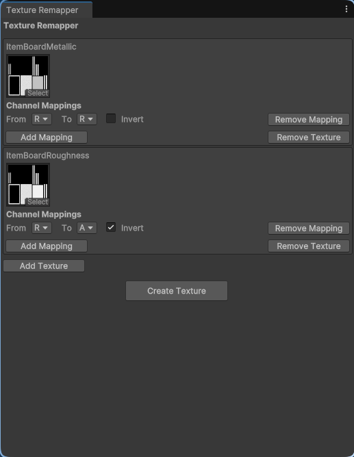
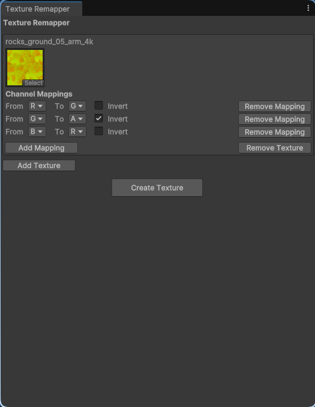

# Texture Remapper
This Unity tool allows you to easily combine channels of one or more textures into a new one.<br/>

## Usage
This tool is made and tested in Unity 6, other versions may work too.

### Importing
Simply clone this repository to your Assets directory:
```
git clone https://github.com/nnra6864/UnityTextureRemapper
```
Or add it as a submodule to your git repo (make sure to adjust the url and path)
```
git submodule add ../nnra6864/TextureRemapper Assets/TextureRemapper
```

### Accessing Texture Remapper
#### Context Menu
If one or more texture assets are selected in the asset browser, you can right-click to access the Context Menu that will have a new option, `Remap Textures`, which opens the tool window and automatically loads selected textures in.

#### Editor Window
You can also access the `Remap Textures` window by navigating to the `Toolbar -> NnUtils -> Remap Textures`. This won't import selected textures.

### Using Texture Remapper
#### Texture
`Add Texture` adds a new texture.<br/>
`Remove Texture` button removes the corresponding texture.<br/>
Select the input texture of your choice and proceed to mapping.

#### Mapping
`Add Mapping` adds a new mapping.<br/>
`Remove Mapping` removes the corresponding mapping.<br/>
`From` represents the channel tool will select from the input texture.<br/>
`To` represents the channel of the output texture we are mapping to.<br/>
`Invert` determines whether the input channel will be inverted when mapping, e.g. Roughness to Smoothness.

#### Creating the Output Texture
Simply click the Create Texture button and choose the path texture will be saved to.

## Examples
<details>
<summary><h3>Metallic and Roughness to MetallicSmoothness</h3></summary>
Metallic map in Unity actually holds 2 values, Metallic in the R channel, and Smoothness in the A channel, therefore, I'll be referring to it as MetallicSmoothness.<br/>
When baking textures in Blender, you usually don't have the MetallicSmoothness option.<br/>
To simplify the Blender workflow and avoid editing the shader etc., we can simply remap easy to bake Metallic and Roughness to MetallicSmoothness.<br/>

| From      | Channel | To         | Channel | Invert |
|-----------|---------|------------|---------|--------|
| Metallic  | R       | Metallic   | R       | X      |
| Roughness | R       | Smoothness | A       | ✓      |


</details>

<details>
<summary><h3>ARM to MAS</h3></summary>
ARM is a commonly found map type that holds Ambient Occlusion, Roughness and Metallic values.<br/>
Unity Terrain, for example, expects a different kind of map, let's call it MAS, which stands for Metallic, Ambient Occlusion, Smoothness.<br/>
Whilst we can easily map AO from channel R to channel G, and Metallic from B to R, since Roughness is the opposite of Smoothness, we also have to Invert it when mapping from G to A.

| From              | Channel | To                | Channel | Invert |
|-------------------|---------|-------------------|---------|--------|
| Ambient Occlusion | R       | Ambient Occlusion | G       | X      |
| Roughness         | G       | Smoothness        | A       | ✓      |
| Metallic          | B       | Metallic          | R       | X      |


</details>
